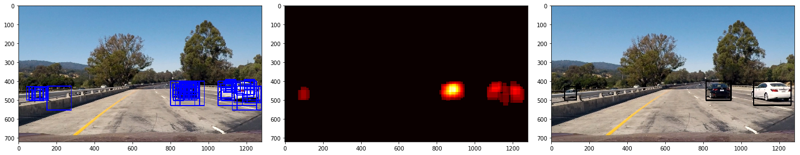

# Vehicle Detection

**Vehicle Detection Project**

The goals / steps of this project are the following:

* Perform a Histogram of Oriented Gradients (HOG) feature extraction on a labeled training set of images and train a classifier Linear SVM classifier
* Optionally, you can also apply a color transform and append binned color features, as well as histograms of color, to your HOG feature vector. 
* Note: for those first two steps don't forget to normalize your features and randomize a selection for training and testing.
* Implement a sliding-window technique and use your trained classifier to search for vehicles in images.
* Run your pipeline on a video stream (start with the test_video.mp4 and later implement on full project_video.mp4) and create a heat map of recurring detections frame by frame to reject outliers and follow detected vehicles.
* Estimate a bounding box for vehicles detected.

## Writeup
All the code related to this project located in this [jupyter notebook](https://github.com/samuelpfchoi/CarND-P5-Vehicle-Detection/blob/master/P5.ipynb)

### Overviews
In this project, the approach is a relatively classic, which applies traditional computer vision technique, such as Histogram of Oriented Gradients (HOG) etc., to extract image features and used them to train a traditional machine learning classifier, SVM on images
of cars and non-cars and then run a sliding window search on each video frame to identify the location of any cars.

### Data Sets
[KITTI](http://www.cvlibs.net/datasets/kitti/) and [GTI](http://www.gti.ssr.upm.es/data/Vehicle_database.html) data sets as well as the extra data that comes with the CarND course are used for training. They are separated only two classes: "cars" and "notcars" and all image are resized to 64x64 pixels for feature extraction. The main idea is to use these images to train a model which enable to determinate if there is any car and where given a frame of a road.

### Feature Extraction

The combination of features is used as feature vector: Spatial feature; Histogram of color; and Histogram of oriented gradients (HOG); and then the feature vector will pass into SVM classifier for training a classifier model, which will be used for car detection later.

**Histograms of Color**

Histogram of color captures the statistical distribution of colors and the essential tone of each image patch. By comparing histograms signatures of two images and matching the color content of one image with the other. The color histogram is particularly well suited for the problem of recognizing an object of unknown position and rotation within a scene. However, it depends only in color, it may results a false
positive if the histogram of color matches with image region that has not the shape of target object, but similar color. 

**Spatial Feature**

Spatial features group color feature into bins spatially. It just resizes an image into very small patch (16x16 pixels) and flatten into a single list of values.

**Histogram of Oriented Gradients (HOG)**

The HOG features capture the gradient structure of each image channel and work well under different lighting conditions. It makes the feature vector more robust to variations of perspective and illumination by aggregating the gradients on an image in a histogram.

### Training a linear support vector machine

Support vector machines (SVM) are supervised learning models with associated learning algorithms that analyze data used for classification and regression analysis. Given a set of training examples, each marked as belong to one or the other of two categories, an SVM training algorithm builds a model that assigns new examples to one category or the other.

### Sliding Windows Search

**Sliding Windows**

The sliding window search splits image into no. of smaller window, smaller square patch with some overlap. For every window, the feature vector is computed and fed into the trained SVM model. As the cars appear at different distances, it is also necessary to search at several scales. Commonly over a hundred feature vectors need to be extracted and fed into the SVM model for every single frame. Fortunately, this part can be vectorized.

The following images illustrate the sample of sliding windows

Multi-scale sliding windows are used as following:

Then, cars are detected by the trained SVM model as shown below

**Heatmap**

Creating a heat map and adding "heat" to areas where the classifier made a positive prediction – more overlapping detections were given more heat.  

Since false positive tend to have only one or two overlapping detections, where true positive tend to have several, a threshold was applied to the heatmap and essentially turned off all the weak spots. 

Finally, the bounding boxes for individual car are determined by the bounds of the heatmap label. 

### Test Images

### Video Implementation

Here's a [link to my video result](./output_project_video.mp4)

or views the result in youtube

    

### Discussion

Problems / issues faced in the implementation of this project:
* More dataset are required to acheive higher accuracy, but it may cause longer longer computation time for both training model and classification.
* Difficult to find out why some image cannot be classified correctly.

Potential problem:
* When two or more cars overlaying together, the pipline cannot identify the count of car correctly.